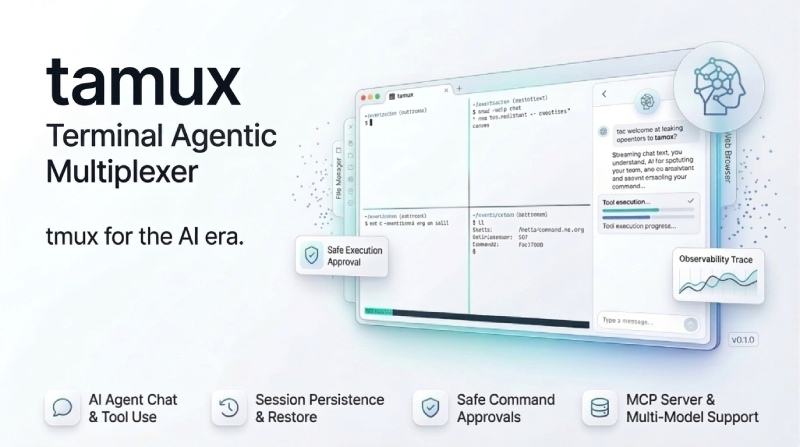

```
  _                             
 | |_ __ _ _ __ ___  _   ___  __
 | __/ _` | '_ ` _ \| | | \ \/ /
 | || (_| | | | | | | |_| |>  < 
  \__\__,_|_| |_| |_|\__,_/_/\_\

  Terminal Agentic Multiplexer
```

# tamux

**Terminal Agentic Multiplexer** -- a daemon-first terminal environment for long-running AI workflows.

Official website: [https://tamux.app](https://tamux.app)


tamux combines tmux-like session management with first-class AI agent integration, structured safety infrastructure, and a modern React-based UI. The backend is written in Rust for performance and reliability; the frontend is a React/TypeScript application rendered inside an Electron shell.


---

## Overview

tamux is an agentic-first terminal multiplexer designed to serve as a unified command environment where humans and AI agents collaborate. Rather than bolting AI onto a traditional terminal, tamux treats autonomous execution as a core primitive alongside PTY management, session persistence, workspace isolation, and approval-aware operations.

The daemon runs independently of any UI client, ensuring that agent workflows, long-running processes, background tasks, and durable goal runs survive disconnects and can be reattached from any client -- CLI, Electron, or a future web interface.

Key design principles:

- **Daemon-first architecture.** All session state lives in the daemon. The UI is a stateless renderer.
- **Long-running autonomy.** Goal runners can plan, execute, replan, reflect, and persist what they learn over time instead of being limited to one prompt/response turn.
- **Safety by default.** Managed commands pass through sandbox isolation, AST validation, policy evaluation, and structured approval workflows before execution.
- **Observable AI.** The agent's reasoning traces, tool calls, and decisions are surfaced in dedicated UI planes rather than hidden behind a black box.
- **Multi-provider flexibility.** Connect to 16 LLM providers out of the box, or bring your own via a custom endpoint.

### Autonomy Loop

tamux now supports a durable autonomy loop for daemon-managed agent workflows:

1. **Start a goal run.** Give the daemon a long-running objective instead of a single prompt.
2. **Generate a plan.** The built-in agent decomposes the goal into actionable steps.
3. **Execute child work.** Steps spawn queued tasks and managed terminal commands inside the daemon.
4. **Pause for approvals.** High-risk work stops behind the normal structured approval flow.
5. **Reflect and learn.** Successful runs can update persistent memory and generate reusable skills from the trajectory.


### Quick Start

If you want to see the new feature fast:

1. Start `tamux-daemon`.
2. Launch the Electron app.
3. Open the agent panel and switch to the built-in `daemon` backend.
4. Go to `Goal Runners` and enter a long-running objective.
5. Watch the daemon generate a plan, enqueue child tasks, pause for approvals if needed, and persist the final reflection.

### Example Goal

Example prompt:

> Investigate why the nightly Rust build is failing, summarize the root cause, propose the smallest fix, and save any reusable workflow as a skill.

Expected flow:

- tamux creates a goal run
- the daemon plans the work into steps
- child tasks execute in the queue
- risky commands pause for approval
- the final run can write durable memory and generate a reusable skill document

---

## Key Features


<center>
  
</center>

### Terminal Management

- **BSP (Binary Space Partition) layout engine** for splitting panes horizontally and vertically with automatic tiling.
- **Infinite canvas mode** with free-form draggable, resizable panels supporting both terminal and embedded browser panel types.
- **Layout presets** and resizable panels via `react-resizable-panels`.
- **Directional focus navigation** between panes (left, right, up, down).
- **Workspaces** with independent surfaces (tabs), each containing its own pane tree.
- **Session persistence** -- restore window state, workspaces, surfaces, pane layouts, and scrollback on restart.
- **Multiple shell profiles** with per-profile working directory, environment variables, and theme overrides.
- **Terminal transcripts** automatically captured on pane close or clear, with configurable retention.

### Agent Integration

- **Multi-provider LLM chat panel** with streaming responses, token tracking, and conversation memory.
- **16 built-in providers** (see table below) plus a custom endpoint option.
- **Durable goal runners** for long-running objectives that plan, execute, reflect, and learn over time.
- **Daemon-owned agent task queue** for background work that survives UI disconnects and restarts.
- **Goal-run child tasks** -- goal runners translate plan steps into queued daemon work and track progress across those child tasks.
- **Task dependencies, retries, and session targeting** so queued work can model ordered execution and bind managed commands to a specific PTY session.
- **First-class queue tools for daemon agents and MCP clients** -- agents can enqueue, inspect, cancel, and schedule background jobs instead of treating the queue as a UI-only feature.
- **Approval-aware background execution** -- queued tasks can pause in `awaiting_approval` and resume or fail when an operator resolves the approval request.
- **Scheduled execution** for delayed automations, reminders, and follow-up gateway actions using either relative delays or absolute timestamps.
- **Honcho memory integration** for cross-session recall, with either managed cloud or a self-hosted base URL.
- **Configurable system prompts** and agent personas.
- **Context compaction** -- automatic summarization when the conversation exceeds a configurable token budget, preserving recent messages while compressing history.
- **Bash tool** allowing the agent to execute shell commands within managed sessions.
- **Web search tool** integration (Firecrawl, Exa, Tavily).
- **agent_query_memory tool** for targeted long-term memory lookups during legacy frontend agent runs.
- **Procedural skills ecosystem** -- the daemon can generate reusable SKILL.md documents from successful execution trajectories, including completed goal runs.
- **Semantic symbol search** powered by tree-sitter AST indexing.

### Infrastructure

- **Sandbox isolation** using Linux namespaces / macOS Seatbelt to constrain managed command execution to the workspace boundary.
- **Ephemeral network toggling** -- network access is granted per-command and revoked on termination.
- **Filesystem snapshots** via pluggable backends: tar (portable), ZFS (copy-on-write, immutable), or BTRFS.
- **WORM (Write-Once-Read-Many) integrity** -- append-only telemetry ledgers with SHA-256 hash chains, verifiable at any time.
- **CRIU checkpoint/restore** -- freeze and restore process state (CPU registers, memory, file descriptors) for instant crash reversal.
- **Credential scrubbing** -- automatic redaction of AWS keys, GitHub tokens, Bearer tokens, private keys, and other sensitive patterns from terminal output and logs.

### Policy Engine

- **Risk-pattern matching** with built-in rules for destructive operations (`rm -rf /`, `git push --force`, `terraform destroy`, `curl | bash`, disk-level mutations, service lifecycle changes).
- **Structured approval payloads** including the command, agent rationale, risk level, blast radius, and scope.
- **Three-option approval flow**: Allow Once, Allow For Session, Deny.
- **Cerbos integration** for external Attribute-Based Access Control (ABAC) policy evaluation.
- **PreToolUse / PostToolUse hooks** on the daemon event bus.

### Mission Control

- **Operational event tracking** -- command execution duration, exit codes, payloads in replayable JSONL.
- **Cognitive event tracking** -- agent reasoning traces, retrieved memory embeddings, compiled prompts.
- **Contextual telemetry** -- CPU, memory, and system health correlated with agent actions.
- **Goal-run visibility** -- inspect durable autonomous runs, current plan step, child task progress, and final reflection output.
- **Persistent task-tray visibility** for queued, blocked, running, approval-pending, failed, and completed agent jobs.
- **Approval workflows** rendered as structured interceptor modals rather than raw Y/N prompts.
- **Context snapshots** capturing the full workspace/session state before managed command batches.
- **Shared cursor model** -- visual distinction between human input, agent-managed execution, approval-pending, and idle states.

### Persistence

- **SQLite-backed operational state** for command logs, agent threads/messages, agent task queue state/dependencies/logs, goal-run state/steps/events, transcript metadata, mission events, WORM tips, and snapshot indexes.
- **Single daemon-owned source of truth** shared by the Rust daemon, CLI bridge, Electron shell, and frontend stores.
- **Transcript log files preserved on disk** while their searchable index lives in SQLite.
- **Agent mission MEMORY.md and USER.md preserved as editable markdown files** alongside SQLite-backed structured events, reflections, and generated skills.

### MCP Server

- **tamux-mcp** exposes the daemon as a Model Context Protocol server over JSON-RPC stdio transport.
- Register it with Claude Code, Cursor, or any MCP-compatible client to give external agents access to terminal sessions, managed execution, snapshot management, history search, and the daemon task queue.
- MCP clients can enqueue delayed jobs with task metadata such as dependencies, preferred session, and scheduled execution time.

### Chat Gateway

- **tamux-gateway** bridges Slack, Discord, and Telegram to the daemon.
- Incoming messages matching a command prefix are translated into managed command requests.
- Queue-aware gateway commands can enqueue immediate or scheduled daemon tasks, including reminders that reply back to the originating chat destination.
- Daemon responses are streamed back to the originating chat channel.
- Per-chat session stores maintain conversation context across messages.

Gateway command examples:

- `/run cargo test` -- run immediately in the shared gateway session.
- `/task investigate why the nightly build failed and send the summary back here` -- enqueue background work for the daemon agent.
- `/schedule 30m -- !git fetch --all` -- run a managed command after a delay.
- `/schedule 2026-03-18T09:00:00Z -- send a standup reminder to this channel` -- schedule a general agent task at an absolute time.
- `/remind 10m -- Standup starts in ten minutes` -- schedule a reminder back to the same Slack/Discord/Telegram destination.
- `/tasks` -- list daemon-managed tasks.
- `/cancel-task <task-id>` -- cancel a daemon-managed task.

### Embedded Browser

- **Canvas browser panels** -- add fully functional web browsers directly on the infinite canvas alongside terminal panels.
- **Independent browser instances** -- each canvas browser panel has its own URL, navigation history, address bar, and Electron webview, operating independently of the sidebar browser and of every other canvas browser.
- **Agent-accessible** -- browser panels are surfaced in `list_terminals` (with `type=browser` and current URL) and `read_active_terminal_content` (returns page title, URL, and optionally DOM text content for agent consumption).
- **Canvas browser controller registry** -- each browser panel registers a lightweight controller exposing `getUrl`, `getTitle`, `navigate`, `getDomSnapshot`, and `executeJavaScript`, enabling agent tools and MCP integrations to read and interact with canvas browsers programmatically.
- **Persistable** -- browser panel URLs survive session save/restore; the panel type, position, and current URL are serialized alongside terminal panels.
- **Sidebar browser** -- a separate resizable browser panel docked to the side of the workspace, with full BrowserChrome navigation, fullscreen toggle, and global browser controller registration for agent tool integration (screenshots, DOM snapshots, navigation commands).

### UI Features

- **Command palette** (Ctrl+Shift+P) with fuzzy search across all actions and keybindings.
- **In-terminal search** with match highlighting and navigation.
- **Session vault** for browsing, searching, and replaying historical transcripts.
- **Snippet picker** for storing and inserting reusable text fragments.
- **Command log** with execution history, exit codes, and duration tracking.
- **System monitor** panel showing real-time CPU, memory, and process telemetry.
- **Execution canvas** -- a React Flow-based node graph for visualizing agent tool-call chains as a directed acyclic graph (DAG).
- **Reasoning stream** -- a dedicated panel parsing and rendering the agent's inner monologue and scratchpad.
- **Time-travel slider** -- browse and restore filesystem/process snapshots along a visual timeline.
- **Agent approval overlay** -- structured security interceptor with blast-radius visualization.
- **Notification system** supporting OSC 9, OSC 99, and OSC 777 protocols.
- **Theming** with built-in themes (Catppuccin Mocha default) and full custom color overrides.

---

## Architecture

```text
+-------------------+     +-------------------+     +-------------------+
|   Electron Shell  |     |     tamux CLI     |     |   tamux-gateway   |
|  React/TypeScript |     |  (clap commands)  |     | Slack/Discord/TG  |
+--------+----------+     +--------+----------+     +---------+---------+
         |                         |                          |
         |    IPC (Unix socket     |    IPC (Unix socket      |
         |     or TCP on Win)      |     or TCP on Win)       |
         +------------+------------+------------+-------------+
                      |                         |
               +------+-------------------------+-------+
               |           tamux-daemon                 |
               |                                        |
               |  +----------+  +----------+  +-----+   |
               |  | PTY Bus  |  | Lane     |  | AST |   |
               |  | Manager  |  | Queue    |  | Val |   |
               |  +----------+  +----------+  +-----+   |
               |  +----------+  +----------+  +------+  |
               |  | Snapshot |  | Policy   |  | Cred |  |
               |  | Engine   |  | Engine   |  | Scrub|  |
               |  +----------+  +----------+  +------+  |
               |  +----------+  +----------+  +------+  |
               |  | CRIU     |  | WORM     |  | FTS5 |  |
               |  | C/R      |  | Ledger   |  | Hist |  |
               |  +----------+  +----------+  +------+  |
               +----------------------------------------+
                      |
               +------+--------+
               | tamux-protocol|
               | (bincode IPC) |
               +---------------+

               +-------------------+
               |     tamux-mcp     |
               | JSON-RPC / stdio  |
               | (MCP server)      |
               +-------------------+
```

**Crate layout:**

| Crate | Role |
|---|---|
| `tamux-protocol` | Shared message types, length-prefixed bincode codec, and configuration |
| `tamux-daemon` | Background daemon: PTY management, lane queue, snapshots, policy engine, CRIU, credential scrubbing, WORM telemetry, tree-sitter indexing, SQLite/FTS5 history |
| `tamux-cli` | Command-line client crate that builds the `tamux` binary (`tamux list`, `tamux new`, `tamux attach`, `tamux kill`, `tamux exec`, `tamux ping`) |
| `tamux-gateway` | Chat platform bridge crate that builds the `tamux-gateway` binary |
| `tamux-mcp` | MCP server crate that builds the `tamux-mcp` binary |

---

## Supported Providers

| Provider | ID | Default Model | Base URL |
|---|---|---|---|
| Featherless | `featherless` | meta-llama/Llama-3.3-70B-Instruct | api.featherless.ai |
| OpenAI | `openai` | gpt-4o | api.openai.com |
| Anthropic | `anthropic` | claude-sonnet-4-20250514 | api.anthropic.com |
| Qwen | `qwen` | qwen-max | api.qwen.com |
| Qwen (DeepInfra) | `qwen-deepinfra` | Qwen/Qwen2.5-72B-Instruct | api.deepinfra.com |
| Kimi (Moonshot) | `kimi` | moonshot-v1-32k | api.moonshot.ai |
| Z.AI (GLM) | `z.ai` | glm-4-plus | api.z.ai |
| OpenRouter | `openrouter` | anthropic/claude-sonnet-4 | openrouter.ai |
| Cerebras | `cerebras` | llama-3.3-70b | api.cerebras.ai |
| Together | `together` | meta-llama/Llama-3.3-70B-Instruct-Turbo | api.together.xyz |
| Groq | `groq` | llama-3.3-70b-versatile | api.groq.com |
| Ollama (local) | `ollama` | llama3.1 | localhost:11434 |
| Chutes | `chutes` | deepseek-ai/DeepSeek-V3 | llm.chutes.ai |
| Hugging Face | `huggingface` | meta-llama/Llama-3.3-70B-Instruct | api-inference.huggingface.co |
| MiniMax | `minimax` | MiniMax-M1-80k | api.minimax.io |
| Custom | `custom` | (user-defined) | (user-defined) |

All providers use OpenAI-compatible chat completion endpoints. Switch providers at any time from the Settings panel or by updating the agent configuration. Each provider's base URL, model, and API key are independently configurable.

## Persistence And Memory

tamux now stores high-churn UI and agent state in the daemon's SQLite database instead of scattered JSON indexes. That includes command logs, agent threads and messages, AJQ task records with dependency edges and task logs, goal-run records with steps and lifecycle events, transcript indexes, mission-control event streams, WORM cache tips, and snapshot indexes. The goal is one durable store that survives UI restarts and can be shared consistently across Electron, the CLI bridge, and daemon-side agents.

Transcript bodies still live as plain `.log` files under the data directory, and agent mission notes still keep `MEMORY.md` and `USER.md` as editable text. Goal runs can append durable learnings to memory and generate reusable skills, while their structured history stays searchable in SQLite.

The AJQ scheduler runs inside the daemon and dispatches work across execution lanes. Session-bound tasks use dedicated `session:<id>` lanes, generic daemon work stays on `daemon-main`, and tasks that are waiting on dependencies, lane availability, or a workspace lock surface that state in the UI instead of silently stalling. Goal runners sit above that queue: they plan work, spawn child tasks, watch approvals and failures, and replan when needed.

Legacy frontend agent runs can optionally sync conversations into Honcho. When enabled, tamux writes user and assistant turns to Honcho, requests per-thread context before a new turn, and exposes an `agent_query_memory` tool for explicit recall. For managed cloud, set an API key and workspace ID. For self-hosted Honcho, also set the base URL in the Agent settings panel.

---

## Documentation

- [Getting Started Guide](docs/getting-started.md)
- [Goal Runners Guide](docs/goal-runners.md)
- [Agentic Mission Control Notes](docs/agentic-mission-control.md)
- [Building CDUI Components And Views With YAML](docs/cdui-yaml-views.md)
- [Creating Your Own tamux Plugin](docs/plugin-development.md)

Suggested next reads:

- Start with the Getting Started guide if you want to run tamux locally.
- Read Goal Runners if you want the lifecycle, limits, and operator controls for long-running autonomy.
- Read Agentic Mission Control if you want the UI and operator model behind approvals, trace, and long-running autonomy.

Runtime-installed plugins are now supported through `tamux install plugin <npm-package-or-local-path>`.

External npm plugins should declare a `tamuxPlugin` field in their `package.json` that points to a self-contained browser script entry file. The legacy `amuxPlugin` field is still accepted for compatibility.

## Getting Started

### Prerequisites

- **Rust** 1.75+ (2021 edition) with `cargo` -- https://rustup.rs
- **Node.js** 18+ with `npm` -- https://nodejs.org
- **Electron** 33+ (installed automatically via npm)
- **uv** (`aline` is optional but recommended for OneContext recall features)

Optional system dependencies:

- `criu` binary for checkpoint/restore (Linux only, requires root privileges)
- ZFS or BTRFS filesystem for copy-on-write snapshots
- Cerbos PDP for external policy evaluation

### Setup Preflight

Run dependency checks before building or running:

```bash
./scripts/setup.sh --check --profile source
```

For desktop runtime-only checks:

```bash
./scripts/setup.sh --check --profile desktop
```

On Windows PowerShell:

```powershell
.\scripts\setup.ps1 -Check -Profile source
```

### Build

```bash
# Build all Rust crates (daemon, CLI, gateway, MCP server)
cargo build --release

# Install frontend dependencies and start the development server
cd frontend
npm install
npm run dev
```

### Optional Honcho Setup

1. Open Settings > Agent.
2. Enable `Honcho Memory`.
3. Set `Honcho API Key` and `Honcho Workspace`.
4. Leave `Honcho Base URL` empty for Honcho Cloud, or set it to your self-hosted endpoint.

### Build Components

Build the repository in slices depending on what you are changing:

```bash
# Rust workspace only
cargo build --release

# Individual Rust components
cargo build --release -p tamux-daemon
cargo build --release -p tamux-cli
cargo build --release -p tamux-gateway
cargo build --release -p tamux-mcp
cargo build --release -p tamux-protocol

# Frontend web bundle
cd frontend
npm install
npm run build

# Electron desktop package
cd frontend
npm run build:electron
```

Recommended component-level workflow:

- Backend-only changes: run `cargo build --release` or the specific `-p` crate you changed.
- Frontend UI/component changes: run `cd frontend && npm run build`.
- Electron bridge or preload changes: run `cd frontend && npm run build` and then `cd frontend && npm run dev:electron`.
- End-to-end desktop packaging changes: run `cd frontend && npm run build:electron`.

### Run

```bash
# Start the daemon (required for all clients)
cargo run --release --bin tamux-daemon

# In another terminal, start the Electron app
cd frontend
npm run dev:electron

# Or use the CLI directly
cargo run --release --bin tamux -- list
cargo run --release --bin tamux -- new --shell bash
cargo run --release --bin tamux -- attach <session-id>
cargo run --release --bin tamux -- kill <session-id>
cargo run --release --bin tamux -- ping
```

### OSC Attention Notifications (OSC 9 / 99 / 777)

tamux supports in-app notifications emitted from terminal output using OSC sequences.

Supported formats:

- `OSC 9`: `9;<message>`
- `OSC 777`: `777;notify;<title>;<body>`
- `OSC 99`: `99;<text>` (or metadata + `;<text>`)

You can open the in-app notification panel with `Ctrl+I`.

Quick smoke test commands (run inside a tamux terminal pane):

```bash
printf '\033]9;Claude needs attention\007'
printf '\033]777;notify;Claude;Waiting for your input\007'
printf '\033]99;Codex finished task\007'
```

Optional shell helpers (`~/.bashrc` / `~/.zshrc`):

```bash
osc9() {
  printf '\033]9;%s\007' "$*"
}

osc777() {
  local title="$1"; shift
  printf '\033]777;notify;%s;%s\007' "$title" "$*"
}

osc99() {
  printf '\033]99;%s\007' "$*"
}
```

After editing shell config, run `source ~/.bashrc` (or `source ~/.zshrc`).

### Electron Production Build

```bash
cd frontend
npm run build:electron
```

This produces platform packages in `frontend/release/`:
- **Linux:** AppImage and .deb
- **Windows:** Portable executable and NSIS installer

### Release Packaging

Use the platform-specific release scripts when you want upload-ready artifacts gathered under `dist-release/`.

If you want to rebuild the full production release layout from scratch after deleting `dist-release/`, use the wrapper below. This is the exact entrypoint for recreating the same release folder structure that was previously generated during release work.

```bash
# Recreate dist-release/ from scratch
./scripts/build-production-releases.sh
```

On a Linux host, that wrapper:

- deletes and recreates `dist-release/`
- runs the native Linux production build into `dist-release/linux/`
- runs the Windows cross-build into `dist-release/windows/` when `mingw-w64` is installed
- preserves the per-platform bundle structure:
  - raw Rust binaries
  - Electron packages/installers
  - `SHA256SUMS.txt`
  - `RELEASE_NOTES.md`
  - one zip bundle per platform

Current output layout after a successful Linux + Windows rebuild:

```text
dist-release/
  linux/
    tamux
    tamux-daemon
    tamux-gateway
    tamux-mcp
    GETTING_STARTED.md
    tamux-<version>.AppImage
    tamux_<version>_amd64.deb
    tamux-<version>-linux-x86_64.zip
    SHA256SUMS.txt
    RELEASE_NOTES.md
  windows/
    tamux.exe
    tamux-daemon.exe
    tamux-gateway.exe
    tamux-mcp.exe
    GETTING_STARTED.md
    tamux-portable.exe
    tamux Setup <version>.exe
    tamux-<version>-windows-x64.zip
    SHA256SUMS.txt
    RELEASE_NOTES.md
```

Wrapper options:

- `--native-only` builds only the native platform release.
- `--windows-only` builds only the Windows cross-release.
- `--skip-rust`, `--skip-frontend`, and `--skip-electron` are passed through to the native release script.
- `--target <triple>` is passed through to the native release script.
- `--sign` enables signing in child scripts.

```bash
# Linux native release bundle (Rust binaries + frontend + Linux Electron packages)
./scripts/build-release.sh

# Rebuild the full production release layout in dist-release/
./scripts/build-production-releases.sh

# Native macOS release bundle (run on macOS)
./scripts/build-release-macos.sh

# Windows native release bundle (run in PowerShell or cmd.exe on Windows)
powershell -ExecutionPolicy Bypass -File .\scripts\build-release.ps1
scripts\build-release.bat

# Windows cross-build from WSL/Linux for Rust binaries and, when supported, Electron packaging
./scripts/build-release-wsl.sh
```

Host/platform expectations:

- **Linux host:** can build Linux Rust binaries and Linux Electron artifacts.
- **Linux/WSL host:** can also cross-compile Windows Rust binaries and package Windows Electron artifacts when `mingw-w64` is installed.
- **macOS host:** required for signed macOS app bundles, DMGs, and notarization.
- **Windows host:** required for the most reliable signed Windows installers.

Recommended prerequisites for `./scripts/build-production-releases.sh` on Linux:

```bash
sudo apt update
sudo apt install -y mingw-w64
cargo build --release
cd frontend && npm ci && cd ..
```

For a clean end-to-end rebuild, you typically only need to run:

```bash
./scripts/build-production-releases.sh
```

If `mingw-w64` is not installed, the wrapper still produces the native Linux release and skips the Windows cross-release with a clear message.

Useful options:

- `--sign` enables signing in the shell scripts.
- `--target <triple>` on `scripts/build-release.sh` cross-compiles Rust for another target triple.
- `--skip-rust`, `--skip-frontend`, and `--skip-electron` let you resume partial builds.

Signing environment variables:

- `TAMUX_SIGN_CERT` / `TAMUX_SIGN_PASSWORD` for PFX-based signing.
- `TAMUX_SIGN_THUMBPRINT` for Windows certificate store signing.
- `TAMUX_SIGN_IDENTITY` for macOS `codesign`.

Legacy `AMUX_*` signing variables are still accepted for compatibility.

### Plugin Development Build Notes

Pinned guides:

- [Building CDUI Components And Views With YAML](docs/cdui-yaml-views.md)
- [Creating Your Own tamux Plugin](docs/plugin-development.md)

Frontend plugins are currently registered inside the React/Electron frontend and can contribute:

- React components via the component registry
- commands via the command registry
- YAML views persisted under `views/plugins/`

For packaged runtime plugins installed from npm or a local package directory:

- install with `tamux install plugin <npm-package-or-local-path>`
- the package should declare `tamuxPlugin.entry` in `package.json` (legacy `amuxPlugin.entry` is also accepted)
- the entry must be a self-contained browser script that registers itself through `window.TamuxApi.registerPlugin(...)` or `window.AmuxApi.registerPlugin(...)`
- Electron preload loads installed plugin scripts from `~/.tamux/plugins/registry.json` during app startup

The core plugin entry points live in:

- `frontend/src/plugins/PluginManager.ts`
- `frontend/src/plugins/globalAPI.ts`

When building a plugin-backed feature:

- UI-only plugin work still validates through `cd frontend && npm run build`.
- If the plugin depends on filesystem, PATH discovery, or system processes, implement the bridge in `frontend/electron/preload.cjs` and `frontend/electron/main.cjs`, then validate with `cd frontend && npm run dev:electron`.
- Keep plugin runtime modules isolated from daemon code unless the feature truly requires a new daemon capability.

The coding-agents feature follows this model: a frontend plugin-backed UI, an Electron discovery bridge for PATH probing, and launch through the existing terminal pane/session path.

Built-in runtime profiles now include richer support for:

- `Hermes Agent`: interactive CLI, one-shot task mode, gateway mode, config detection under `~/.hermes`, and MCP-oriented setup hints.
- `pi.dev`: interactive CLI, one-shot print mode, RPC mode, and config/session detection under `~/.pi/agent`.
- `OpenClaw`: direct agent mode, gateway runtime mode, config detection under `~/.openclaw`, and local gateway reachability checks for `127.0.0.1:18789`.

The assistant panel now also includes an `AI Training` surface with first-class launch and health support for:

- `Prime Intellect Verifiers`: lab setup, environment init, evaluation run, and eval TUI workflows.
- `AutoResearch`: workspace-aware prepare and train flows for the Karpathy repo workflow.
- `AutoRL`: workspace-aware virtualenv setup and evaluator runs for the Simverse-backed scaffold.

### MCP Server Registration

Register `tamux-mcp` with Claude Code, Cursor, or any MCP-compatible client:

```json
{
  "mcpServers": {
    "tamux": {
      "command": "tamux-mcp"
    }
  }
}
```

---

## Configuration

### Config File Locations

| Platform | Path |
|---|---|
| Linux | `~/.config/tamux/config.json` |
| macOS | `~/Library/Application Support/tamux/config.json` |
| Windows | `%APPDATA%\tamux\config.json` |

Data directory: `~/.tamux/` on Unix, `%LOCALAPPDATA%\tamux\` on Windows. Existing `amux` directories are migrated forward when possible.

### Settings Panel

The built-in Settings panel (Ctrl+,) exposes all configuration options organized into sections:

**Appearance** -- font family, font size, theme selection, opacity, line height, padding, custom terminal colors (background, foreground, cursor, selection).

**Cursor** -- style (bar, block, underline), blink toggle, blink interval in milliseconds.

**Terminal** -- default shell and arguments, scrollback lines (default 10,000), bell sound, visual bell, bracketed paste.

**Behavior** -- session restore on startup, confirm on close, auto-copy on select, Ctrl+click URL opening, auto-save interval, transcript capture on close/clear, command log and transcript retention periods.

**Infrastructure** -- sandbox enabled/disabled, sandbox network access, snapshot backend (tar, zfs, btrfs), WORM integrity toggle, Cerbos PDP endpoint.

**Agent** -- active provider, per-provider API keys and model selection, system prompt, agent name, streaming toggle, conversation memory, context compaction (auto-compact threshold, token budget, messages to keep), bash tool toggle and timeout, web search tool provider and API keys.

**Keybindings** -- rebind any action to a custom key combination, reset all to defaults.

---

## Keyboard Shortcuts

All keybindings are fully customizable from the Settings panel or by editing `keybindings.json`.

### Pane Management

| Action | Default Binding |
|---|---|
| Split horizontal | `Ctrl+D` |
| Split vertical | `Ctrl+Shift+D` |
| Close active pane | `Ctrl+Shift+W` |
| Toggle zoom pane | `Ctrl+Shift+Z` |
| Focus left pane | `Ctrl+Alt+Left` |
| Focus right pane | `Ctrl+Alt+Right` |
| Focus upper pane | `Ctrl+Alt+Up` |
| Focus lower pane | `Ctrl+Alt+Down` |

### Surfaces (Tabs)

| Action | Default Binding |
|---|---|
| New surface | `Ctrl+T` |
| Close surface | `Ctrl+W` |
| Next surface | `Ctrl+Tab` |
| Previous surface | `Ctrl+Shift+Tab` |

### Workspaces

| Action | Default Binding |
|---|---|
| New workspace | `Ctrl+Shift+N` |
| Switch workspace 1-9 | `Ctrl+1` through `Ctrl+9` |
| Next workspace | `Ctrl+PageDown` |
| Previous workspace | `Ctrl+PageUp` |

### Panels and Overlays

| Action | Default Binding |
|---|---|
| Command palette | `Ctrl+Shift+P` |
| Toggle sidebar | `Ctrl+B` |
| Toggle notifications | `Ctrl+I` |
| Toggle settings | `Ctrl+,` |
| Toggle session vault | `Ctrl+Shift+V` |
| Toggle command log | `Ctrl+Shift+L` |
| Toggle search | `Ctrl+Shift+F` |
| Toggle command history | `Ctrl+Alt+H` |
| Toggle snippets | `Ctrl+S` |
| Toggle agent panel | `Ctrl+Shift+A` |
| Toggle system monitor | `Ctrl+Shift+M` |
| Toggle execution canvas | `Ctrl+Shift+G` |
| Toggle time-travel snapshots | `Ctrl+Shift+T` |

---

## Development

### Project Structure

```
cmux-next/
  Cargo.toml                    # Workspace root (5 crates)
  crates/
    amux-protocol/              # Wire protocol, message types, codec, config
      src/
        lib.rs                  # Public API re-exports
        messages.rs             # ClientMessage / DaemonMessage enums + supporting types
        codec.rs                # Length-prefixed bincode framing (AmuxCodec, DaemonCodec)
        config.rs               # AmuxConfig, platform paths, defaults
    amux-daemon/                # Background daemon process
      src/
        main.rs                 # Entrypoint, IPC listener, session registry
        snapshot.rs             # Pluggable snapshot backends (tar, ZFS, BTRFS)
        policy.rs               # Risk-pattern evaluation, approval payload generation
        criu.rs                 # CRIU checkpoint/restore integration
        scrub.rs                # Credential scrubbing (AWS, GitHub, Bearer, hex, PEM)
    amux-cli/                   # Command-line client
      src/
        main.rs                 # Clap subcommands: list, new, attach, kill, exec, ping
        client.rs               # IPC connection to daemon
    amux-gateway/               # Chat platform bridge
      src/
        main.rs                 # Gateway runner, daemon IPC connection
        router.rs               # Message routing between providers and daemon
        slack.rs                # Slack provider implementation
        discord.rs              # Discord provider implementation
        telegram.rs             # Telegram provider implementation
    amux-mcp/                   # MCP server
      src/
        main.rs                 # JSON-RPC stdio server exposing daemon tools
  frontend/                     # React/TypeScript UI + Electron shell
    package.json
    electron/
      main.cjs                  # Electron main process
    src/
      App.tsx                   # Root application component
      components/
        AgentApprovalOverlay    # Structured HITL approval modal
        AgentChatPanel          # Multi-provider LLM chat interface
        AgentExecutionGraph     # Agent tool-call chain visualization
        CommandHistoryPicker    # Historical command browser
        CommandLogPanel         # Execution log with exit codes and durations
        CommandPalette          # Fuzzy-search command launcher
        DataTable               # Structured data rendering
        ExecutionCanvas         # React Flow node-based workflow graph
        LayoutContainer         # Recursive BSP tree to resizable panels
        LoadingState            # Loading indicators
        NotificationPanel       # OSC notification display
        ReasoningStream         # Agent inner-monologue renderer
        SearchOverlay           # In-terminal search with match navigation
        SessionVaultPanel       # Historical transcript browser and replay
        SettingsPanel           # Full configuration UI
        SharedCursor            # Human/agent cursor mode indicator
        Sidebar                 # Workspace and surface navigation
        SnippetPicker           # Reusable text fragment manager
        StaticLog               # Immutable historical log renderer (BFO-safe)
        StatusBar               # Daemon status, mission state, active trace
        SurfaceTabBar           # Surface (tab) bar
        SystemMonitorPanel      # Real-time system telemetry
        TerminalPane            # xterm.js terminal instance
        WebBrowserPanel         # Sidebar docked browser (Electron webview)
        web-browser-panel/
          BrowserChrome         # Navigation bar (back/forward/reload/address)
          CanvasBrowserPane     # Self-contained browser for canvas panels
          WebviewFrame          # Electron <webview> wrapper with auto-resize
        TimeTravelSlider        # Snapshot timeline scrubber
        TitleBar                # Window title bar and controls
      lib/
        agentMissionStore.ts    # Operational + cognitive event tracking store
        agentStore.ts           # Agent settings, providers, threads, messages
        browserRegistry.ts      # Global sidebar browser controller registry
        canvasBrowserRegistry.ts # Per-panel canvas browser controller registry
        bspTree.ts              # Binary space partition tree logic
        commandLogStore.ts      # Command execution log persistence
        dataParser.ts           # Structured data detection and parsing
        graphStore.ts           # Execution graph state
        keybindStore.ts         # Keybinding management and persistence
        layoutStore.ts          # Pane, surface, and layout state
        notificationStore.ts    # Notification management
        persistence.ts          # JSON file persistence utilities
        sessionPersistence.ts   # Workspace/surface/pane session save/restore
        settingsStore.ts        # Application settings store
        snippetStore.ts         # Snippet management
        terminalRegistry.ts     # xterm.js instance registry
        themes.ts               # Theme definitions
        transcriptStore.ts      # Transcript capture and storage
        types.ts                # Core TypeScript type definitions
        workspaceStore.ts       # Workspace management
```

### Key Dependencies

**Rust (daemon side):**

| Crate | Purpose |
|---|---|
| `tokio` | Async runtime with full feature set |
| `portable-pty` | Cross-platform PTY spawning (ConPTY on Windows, posix on Unix) |
| `rusqlite` (bundled) | SQLite with FTS5 for history recall and semantic search |
| `tree-sitter` / `tree-sitter-bash` | AST parsing, validation, and symbol indexing |
| `sysinfo` | System telemetry (CPU, memory, processes) |
| `sha2` | SHA-256 hash chains for WORM ledger integrity |
| `regex` | Risk-pattern matching and credential scrubbing |
| `serde` / `serde_json` / `bincode` | Serialization for IPC and persistence |
| `walkdir` | Recursive directory traversal for workspace indexing |
| `strip-ansi-escapes` | ANSI escape removal for log processing |

**Frontend:**

| Package | Purpose |
|---|---|
| `@xterm/xterm` | Terminal emulation with canvas renderer |
| `@xyflow/react` | React Flow node-based execution graph |
| `react-resizable-panels` | Resizable split pane layout |
| `zustand` | Lightweight state management |
| `vite` | Build tooling and dev server |
| `electron` | Desktop application shell |
| `electron-builder` | Cross-platform packaging |

### IPC Protocol

The daemon and all clients communicate via length-prefixed bincode frames over Unix domain sockets (Linux/macOS) or localhost TCP on port 17563 (Windows). The protocol is defined in `amux-protocol` and consists of two enums:

- `ClientMessage` -- requests from any client to the daemon (spawn, attach, input, execute managed command, resolve approval, list sessions, search history, etc.)
- `DaemonMessage` -- responses and events from the daemon to clients (output, command lifecycle, approval required, search results, snapshots, errors, etc.)

---

## License

[MIT](LICENSE)
