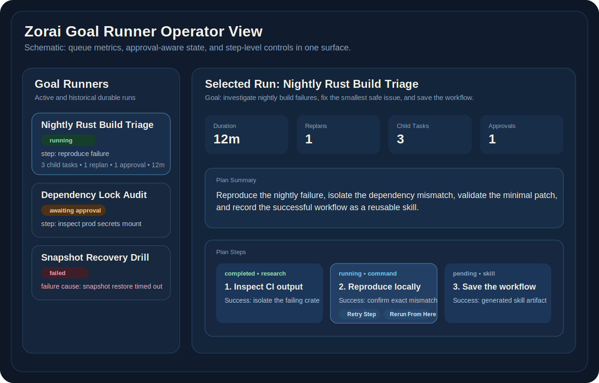

# Goal Runners

Goal runners are tamux's durable autonomy layer. Instead of a single prompt/response exchange, you give the daemon a long-running objective and let it plan, execute, replan, reflect, and persist what it learns.

For the currently landed additive state-transition substrate that goal work can build on, see [state-transition-harness.md](./state-transition-harness.md).



## What A Goal Run Does

1. Accepts a long-running objective from the UI.
2. Uses the built-in daemon agent to generate a structured plan.
3. Converts plan steps into child tasks on the daemon task queue.
4. Watches approvals, retries, failures, and completion.
5. Reflects on the final trajectory.
6. Optionally writes durable memory and generates a reusable skill document.

## Starting A Goal Run

From the TUI:

1. Open `Goals`.
2. Start a new goal to open `Mission Control`.
3. Enter the goal prompt in the preflight view.
4. Confirm the primary agent provider, model, and reasoning effort.
5. Review or edit the role roster before launch.
6. Start the run from Mission Control.

Mission Control preflight is no longer a plain text composer. It is the launch surface for the run:

- `Goal Prompt` keeps the requested outcome in view.
- `Primary Agent` shows the main provider/model/reasoning selection.
- `Role Assignments` shows the roster that will be used for planning and execution.
- `Preset Source` tells you whether defaults came from the previous goal snapshot or from main-agent inheritance.

When a previous goal snapshot exists, its roster is loaded as the default starting point. If no prior snapshot exists, Mission Control initializes every role from the main agent.

Good goal prompts are specific, bounded, and outcome-oriented.

Example:

```text
Investigate why the nightly Rust build is failing, identify the root cause, propose the smallest safe fix, and capture any reusable workflow as a skill.
```

## Lifecycle

Goal runs move through these top-level states:

- `queued`: accepted by the daemon but not planned yet
- `planning`: the daemon is building the initial structured plan
- `running`: the goal is executing or waiting on child-task progress
- `awaiting_approval`: a child task hit a managed-command approval gate
- `paused`: orchestration is paused by the operator
- `completed`: all steps finished and the daemon recorded the final reflection
- `failed`: the run exhausted replanning or failed irrecoverably
- `cancelled`: the operator cancelled the goal run

Step-level status is tracked separately inside the run:

- `pending`
- `in_progress`
- `completed`
- `failed`
- `skipped`

## Mission Control During A Run

While a goal is running, Goals stays an orchestration surface and Threads stays a conversation surface.

Mission Control exposes:

- `Goal overview` for status, current step, approvals, and goal controls.
- `Execution feed` for live tool calls, file updates, messages, errors, and todo changes.
- `Thread router` for opening the active execution thread.
- `Agent roster` for runtime model/provider/role edits.
- `Step board` and dossier details for execution history and evidence.

`Esc` in Goals does not collapse back into inline chat. If you want to steer the active execution thread directly, use `Open active thread` to jump into `/threads`. Threads opened that way show a `Return to goal` affordance so you can safely come back to the same goal run.

Runtime agent edits are operator-safe:

- edits apply to future work by default,
- active-step changes require an explicit confirmation,
- and the roster distinguishes `live now` from `pending next turn`.

When a confirmation is cancelled, the pending Mission Control runtime change is cleared instead of getting stuck in a half-applied state.

## Header Behavior In Mission Control

When Mission Control is focused, the header no longer borrows whatever conversation thread happened to be selected elsewhere. It resolves from the goal run itself:

1. active execution thread runtime metadata,
2. root goal thread runtime metadata,
3. launch assignment snapshot,
4. generic config defaults.

If the live thread is missing, the header still keeps the fallback context window visible so the operator can see which model budget is in effect even before thread hydration completes.

## How Goal Runs Use The Task Queue

Goal runners do not replace the daemon task queue. They sit above it.

- A goal run owns the long-lived objective and plan.
- Each executable step becomes a child task.
- Child tasks run through the existing queue, lane, approval, and retry machinery.
- The goal runner watches those child tasks and decides whether to continue, replan, or fail.

This means goal runners inherit the same safety controls as the rest of tamux:

- managed terminal execution
- approval gating
- snapshots
- queue visibility
- lane and workspace scheduling

## Approvals And Replanning

When a child task hits an approval boundary:

- the task enters `awaiting_approval`
- the goal run surfaces `awaiting_approval`
- execution resumes only after the operator resolves the approval request

When a child task fails:

- the goal runner records the failure
- if replanning budget remains, it asks the daemon agent for revised remaining steps
- if replanning budget is exhausted, the goal run becomes `failed`

## Memory And Skill Output

On successful completion, tamux can produce two durable outputs:

- **Memory update**: appended to `MEMORY.md` only when the reflection identifies a stable fact or operator preference worth preserving
- **Generated skill**: a reusable workflow document derived from the successful trajectory

The structured run history stays in SQLite. The editable memory and skill artifacts remain on disk.

## Current Limits

- Goal runners currently require the built-in `daemon` backend.
- `pause` stops future orchestration but does not forcibly terminate a child task that is already running.
- Reflection-driven memory updates are intentionally conservative and should capture durable knowledge, not temporary run output.
- Runtime agent edits in the current implementation are a TUI-side operator control. They update the live Mission Control roster and confirmation flow, but they do not yet imply a new daemon-side orchestration protocol beyond the existing goal metadata.

## Suggested Operator Workflow

Use goal runners when:

- the task will take multiple steps
- you want child task visibility and approvals
- you want the daemon to survive UI disconnects
- the result may be reusable as durable memory or a procedural skill

Use a normal chat turn when:

- you only need reasoning or a quick answer
- no durable execution loop is required
- the task does not need queueing, replanning, or operator checkpoints
