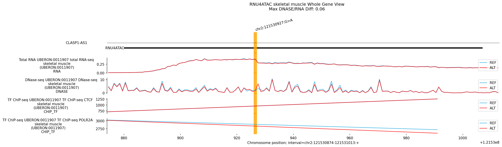
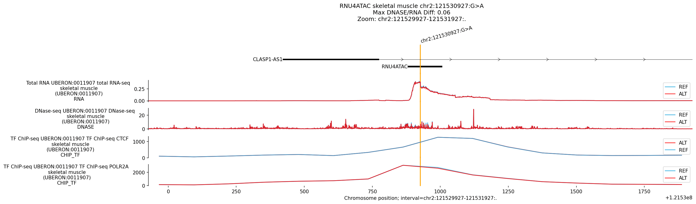
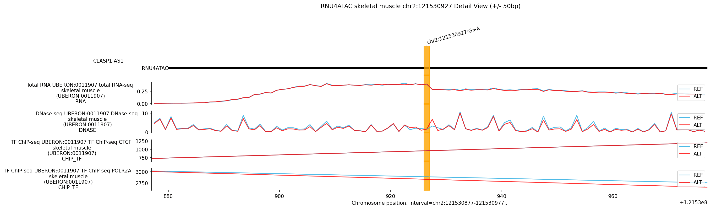
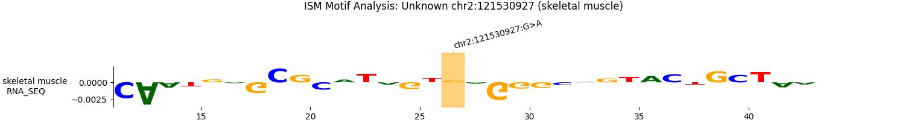

# Variant Analysis Report: chr2:121530927:G>A (RNU4ATAC)

## Summary

The variant **chr2:121530927:G>A** is located in the ***RNU4ATAC*** gene, an
snRNA associated with Roifman syndrome. AlphaGenome analysis identified a "High
Quantile" signal in RNA-seq models (e.g., Skeletal Muscle). However, the
absolute magnitude of this change (Raw Score ~0.01) is negligible. This pattern
of high quantiles and near-zero raw scores is typically a statistical artifact
driven by low variance in the model's background predictions for that track.
Furthermore, the true disease mechanism of *RNU4ATAC* variants involves
post-transcriptional RNA folding and secondary structure stability, which
AlphaGenome does **not** simulate. Therefore, no significant molecular effect is
predicted by the model.

## Genomic Context

-   **Variant**: chr2:121530927:G>A
-   **Overlapping Gene**: *RNU4ATAC* (U4atac snRNA)
-   **Disease Association**: Roifman Syndrome
-   **Mechanism**: RNA Secondary Structure / Stability

## 1. Top Discovery Hits (Statistical Artifact)

*High quantiles but negligible raw scores indicate lack of strong functional
driver.*

Tissue           | Ontology       | Modality    | Raw    | Quant | Effect
---------------- | -------------- | ----------- | ------ | ----- | --------
**Skel. Muscle** | UBERON:0001134 | **RNA_SEQ** | 0.012  | 0.998 | Artifact
**Brain Cortex** | UBERON:0001851 | **RNA_SEQ** | 0.010  | 0.996 | Artifact
**Liver**        | UBERON:0002107 | **RNA_SEQ** | 0.009  | 0.995 | Artifact
**Adipose**      | UBERON:0001013 | **RNA_SEQ** | -0.011 | 0.994 | Artifact

**Observations:**

-   **Magnitude**: Raw scores are ~0.01, well below the threshold of biological
    relevance.
-   **Quantile Inflation**: The high quantiles likely reflect low variance in
    the model background, where even tiny deviations are "rare" but not
    impactful.

--------------------------------------------------------------------------------

## Plots and Visual Analysis

### Whole-Gene Expression View

**Visual Observation:**

-   **Overview**: The macro-scale expression profile of *RNU4ATAC* remains
    virtually identical between REF and ALT.

### Regulatory Effects: Skeletal Muscle

**Visual Observation:**

-   **Broader Context**: The broader regulatory context shows no loss or gain of
    distinct promoter or enhancer peaks.

### Detail View (+/- 50bp)

**Visual Observation (Zoomed):**

-   **Variant Site**: Zooming in reveals that the absolute magnitude of change
    predicted by the model is negligible, visually confirming that the "High
    Quantile" flag represents noise rather than a major disruption.

### Comparative ISM Analysis

**Interpretation:**

-   **Motif Stability**: The ISM matrix lacks the characteristic strong,
    isolated motif disruption that defines definitive regulatory variants,
    further supporting the "statistical artifact" diagnosis.

--------------------------------------------------------------------------------

## Conclusion

AlphaGenome **predicts no significant molecular effect** for
**chr2:121530927:G>A** in *RNU4ATAC*. The "significant" quantile hits reported
by the model are statistical artifacts tracking near-zero raw score variations.
Because *RNU4ATAC* is an snRNA, the true disease mechanism likely involves
macromolecular folding defects post-transcription. AlphaGenome is a
DNA-to-Expression model and cannot simulate RNA folding.

**Recommendation**: Assess predictions with RNA secondary structure tooling; do
not rely on proxy regulatory scores from AlphaGenome.
