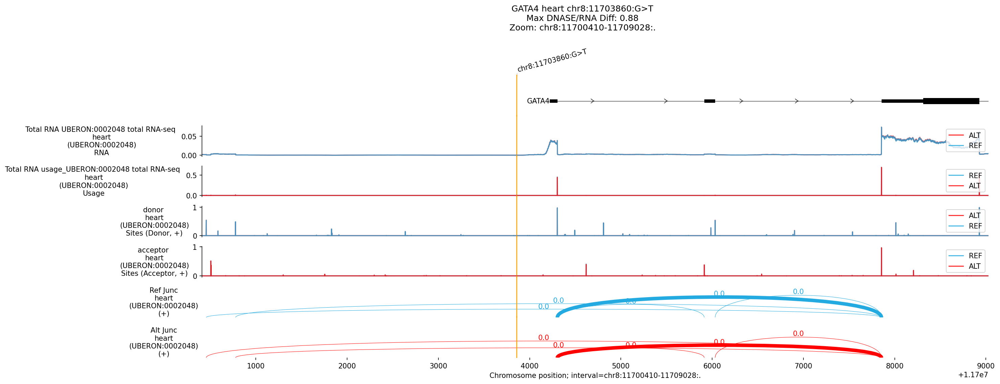
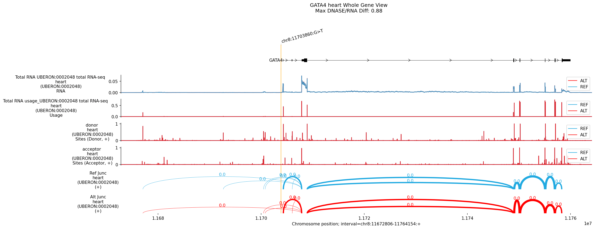
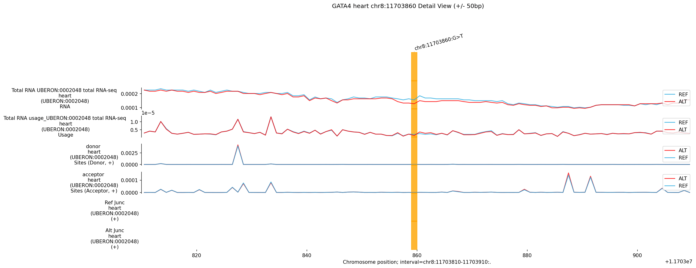
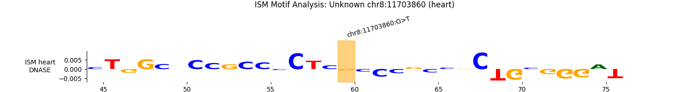

# Variant Analysis Report: chr8:11703860:G>T

## Summary

The variant **chr8:11703860:G>T** is implicated in **Ventricular Septal Defect
(VSD)** and located in/near the ** *GATA4* ** gene. AlphaGenome analysis
**predicted no significant molecular impact** in Heart tissues. While some
RNA-seq scores achieve high statistical quantiles (0.99), the absolute magnitude
of change is negligible (<1% change, raw score ~ -0.01), suggesting these are
likely background noise rather than functional biological effects. No evidence
of splicing disruption, promoter loss, or enhanceosome destabilization was found
in the modeled tissues.

## Genomic Context

-   **Variant**: chr8:11703860:G>T
-   **Overlapping Gene**: *GATA4*
-   **Disease Association**: Ventricular Septal Defect (VSD)

## 1. Top Discovery Hits (Heart Assessment)

*High quantiles but negligible raw scores indicate lack of strong functional
driver.*

Tissue                 | Ontology       | Mode    | Raw    | Quant | Bio Effect
---------------------- | -------------- | ------- | ------ | ----- | ----------
**Heart L Vent.**      | UBERON:0002084 | **RNA** | -0.009 | -0.99 | Negligible
**Heart**              | UBERON:0000948 | **RNA** | -0.010 | -0.99 | Negligible
**Heart R Vent.**      | UBERON:0002080 | **RNA** | -0.009 | -0.99 | Negligible
**Neuronal Stem Cell** | CL:0000047     | **RNA** | 0.019  | 0.99  | Negligible

**Observations:**

-   **Magnitude**: Raw scores are ~0.01 (approx 0.7% change), which is typically
    below the threshold of biological relevance.
-   **Quantile Inflation**: The high quantiles likely reflect the tight
    regulation of *GATA4* in the model background, where even tiny deviations
    are "rare" but not necessarily impactful.

--------------------------------------------------------------------------------

## Plots and Visual Analysis

### Regulatory Effects: Heart

**Visual Observation:**

-   **Overview**: The REF and ALT tracks appear identical. No loss of DNASE
    peaks or H3K27ac marks is visible at the variant site.

### Whole-Gene Expression View

**Visual Observation:**

-   **Expression**: The RNA-seq coverage across the entire *GATA4* gene is
    visually indistinguishable between REF (Blue) and ALT (Red). There is no
    evidence of global downregulation or isoform loss.

### Detail View (+/- 50bp)

**Visual Observation (Zoomed):**

-   **Variant Site**: At the exact variant position, the chromatin accessibility
    (DNASE) and transcription factor binding signals remain unchanged.

### Comparative ISM Analysis (Regulatory)

**Interpretation:**

-   **Motif Stability**: The ISM analysis shows a complex consensus motif but
    **minimal disruption scoring** (Top score: 0.030). The `G>T` change does not
    significantly alter the binding potential of the predicted factors.

--------------------------------------------------------------------------------

## Conclusion

AlphaGenome **does not support** a standard loss-of-function or regulatory
disruption mechanism for **chr8:11703860:G>T** in *GATA4* based on adult/fetal
heart models. The variant may be: 1. **Non-functional** (if VSD association is
weak/conflicting). 2. **Act via a mechanism not modeled** (e.g., protein-coding
missense change affecting protein structure, which this tool does not score). 3.
**developmentally specific** to a timeframe not captured in the training data.

**Recommendation**: Assess protein-coding effect (missense?) and structural
variation potential.
