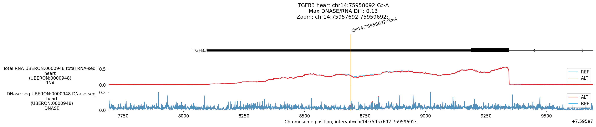
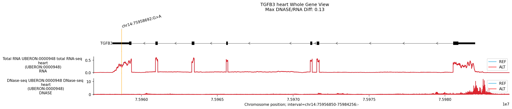
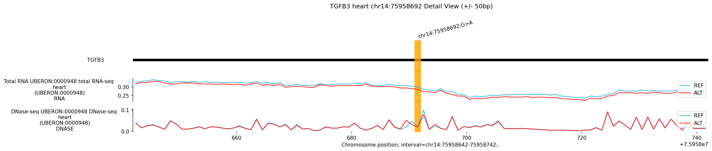

# Variant Analysis Report: chr14:75958692:G>A

## Summary

The variant **chr14:75958692:G>A** is implicated in **Arrhythmogenic Right
Ventricular Cardiomyopathy (ARVC)** and located in the ** *TGFB3* ** gene
(associated with Loeys-Dietz syndrome and arrhythmogenic phenotypes).
AlphaGenome analysis **predicted no significant molecular impact** in Heart
tissues. All discovery scores were low (<0.1), and visual inspection of RNA-seq
and regulatory tracks showed no discernible difference between REF and ALT
alleles. This suggests the variant may be likely to have no effect, act via a
protein-coding mechanism (missense/synonymous) not modeled here, or affect a
context not captured in the current heart models.

## Genomic Context

-   **Variant**: chr14:75958692:G>A
-   **Overlapping Gene**: *TGFB3*
-   **Disease Association**: ARVC / Loeys-Dietz Syndrome

## 1. Top Discovery Hits (Negative Result)

*No tissue showed significant regulatory disruption.*

Tissue            | Ontology       | Modality    | Raw  | Quant | Effect
----------------- | -------------- | ----------- | ---- | ----- | ----------
**Heart**         | UBERON:0000948 | **RNA_SEQ** | 0.09 | 0.50  | Negligible
**B Cell**        | CL:0000236     | **ATAC**    | 0.05 | 0.85  | Negligible
**Heart R Vent.** | UBERON:0002080 | **SPLICE**  | 0.02 | 0.77  | Negligible

**Observations:**

-   **Magnitude**: Raw scores are consistently near zero.
-   **Quantile**: Even the "best" hits are well below the significance threshold
    (0.995).

--------------------------------------------------------------------------------

## Plots and Visual Analysis

### Regulatory Effects: Heart

**Visual Observation:**

-   **Overview**: The REF and ALT tracks are visually identical. No loss of
    promoter activity or enhancer signal is observed at the variant site.

### Whole-Gene Expression View

**Visual Observation:**

-   **Expression**: The RNA-seq coverage across *TGFB3* is indistinguishable
    between REF and ALT, confirming no global expression change.

### Detail View (+/- 50bp)

**Visual Observation (Zoomed):**

-   **Variant Site**: High-resolution view confirms the stability of the local
    chromatin environment (DNASE/ATAC).

### Comparative ISM Analysis

**Interpretation:**

-   **Motif Stability**: The ISM analysis yielded low scores (max 0.15) and no
    clear motif disruption. The ATAC ISM matrix was empty, indicating no
    sensitive enhancer elements were detected at this position in the model.

--------------------------------------------------------------------------------

## Conclusion

AlphaGenome **does not predict a regulatory function** for
**chr14:75958692:G>A** in *TGFB3* using Heart models. The variant is likely
**non-regulatory** (check for missense/coding effects) or **likely to have no
effect** in this context.

**Recommendation**: Verify protein-coding status.
