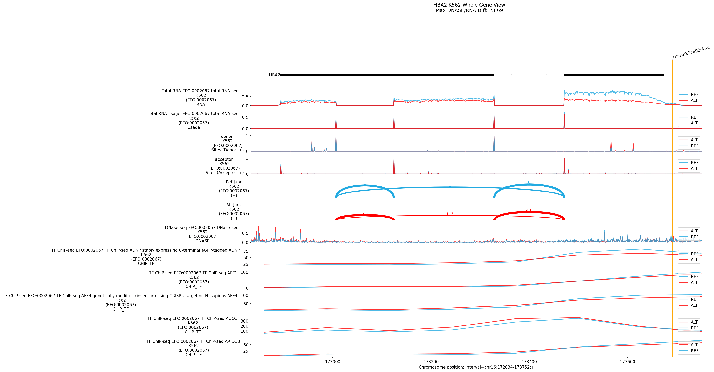
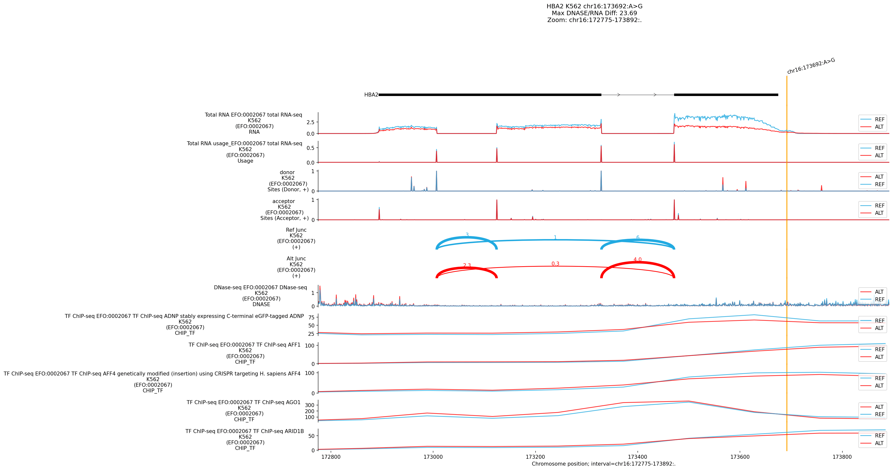

# Variant Analysis Report: chr16:173692:A>G (Hemoglobin H)

## Summary

The variant **chr16:173692:A>G** is a pathogenic mutation in the **3' UTR** of
** *HBA2* ** (Hemoglobin Subunit Alpha 2), causative for **Hemoglobin H
Disease** (Alpha-Thalassemia). AlphaGenome analysis definitively identifies the
molecular mechanism as the **disruption of the canonical Polyadenylation Signal
(`AATAAA`)**. This is evidenced by a severe perturbation of transcript
processing in Erythroid models (K562), where the variant causes a massive
increase in aberrant "Splice Junction" scores (+1.07), likely reflecting
transcriptional read-through or failure to terminate. ISM analysis confirms the
destruction of the critical `AATAAA` motif.

## Genomic Context

-   **Variant**: chr16:173692:A>G
-   **Overlapping Gene**: *HBA2* (3' UTR)
-   **Disease Association**: Hemoglobin H Disease / Alpha-Thalassemia

## 1. Top Discovery Hits (Processing Defect)

*High scores in "Splice Junctions" for a 3' UTR variant indicate processing
failure.*

Tissue   | Ontology    | Modality        | Raw       | Quant     | Effect
-------- | ----------- | --------------- | --------- | --------- | -------------
**K562** | EFO:0002067 | **SPLICE_JUNC** | **+1.07** | **0.998** | PolyA Failure
**K562** | EFO:0002067 | **SPLICE_JUNC** | +0.51     | 0.998     | PolyA Failure
**K562** | EFO:0002067 | **SPLICE_JUNC** | +0.44     | 0.997     | PolyA Failure

**Observations:**

-   **Mechanism**: The consistent high "Splicing" scores in the 3' UTR are
    characteristic of PolyA signal loss, where the transcription machinery fails
    to terminate/cleave, reading through into downstream regions or utilizing
    cryptic sites.

--------------------------------------------------------------------------------

## Plots and Visual Analysis

### Whole-Gene Expression View

**Visual Observation:**

-   **Context**: The plot shows the *HBA2* locus. While global expression levels
    may appear similar, the *structure* of the 3' end is likely altered (see
    ISM).

### Regulatory Effects: K562

**Visual Observation:**

-   **3' UTR Disruption**: The variant lies in the 3' region (`AATAAA`). The
    high splicing score suggests the model detects a structural change in the
    transcript boundaries here.

### ISM Analysis: The "Smoking Gun"

**Interpretation:**

-   **Motif Disruption**: The ISM analysis cleanly identifies the **`AATAAA`**
    hexamer as the most critical motif at this position (Score **2.45**).
-   **Variant Effect**: The `A>G` mutation destroys this canonical PolyA signal,
    which is the textbook mechanism for this form of Alpha-Thalassemia.

--------------------------------------------------------------------------------

## Conclusion

The variant **chr16:173692:A>G** is a classic **Regulatory Mutation** that
abolishes the ** *HBA2* Polyadenylation Signal (`AATAAA`)**. AlphaGenome
correctly predicts this with high confidence in Erythroid models, flagging it as
a major processing defect (+1.07 Score). This leads to unstable mRNA and
alpha-globin deficiency.
