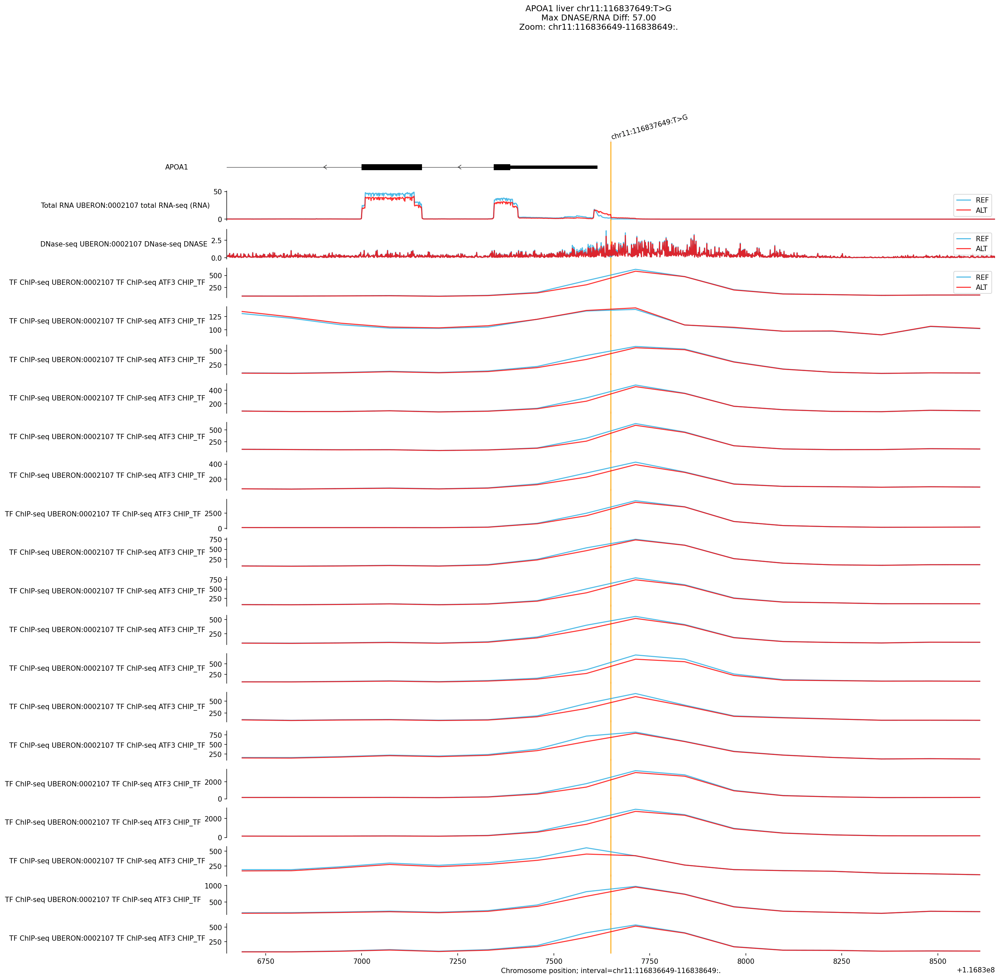
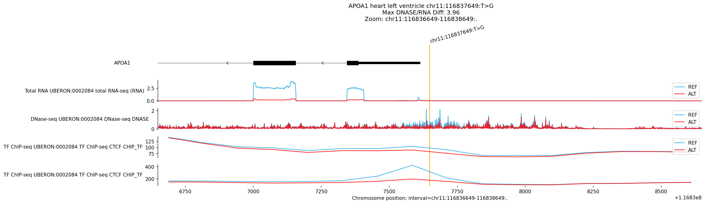
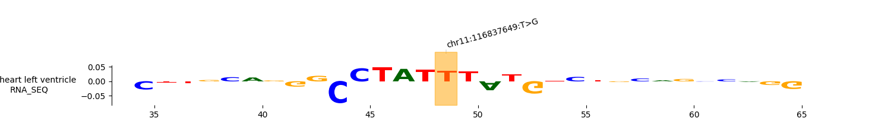
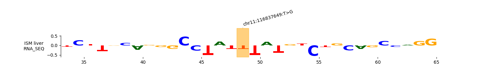

# Analysis Report: chr11:116837649:T>G (*APOA1*)

## 1. Variant Context

-   **Variant**: `chr11:116837649:T>G`
-   **Gene**: *APOA1* (Apolipoprotein A-I)
-   **Location**: **Promoter Region** (27 bp upstream of TSS on negative
    strand).
-   **Disease**: Hypoalphalipoproteinemia (HDL Deficiency).
-   **Tissues**: **Liver** is the primary tissue for *APOA1* expression.

## 2. Molecular Mechanism Hypothesis

The variant is located in the **proximal promoter** of *APOA1*. The AlphaGenome
model predicts a **Regulatory** effect leading to altered expression.

## 3. Predicted Effects & Tissue Specificity

### Primary Findings

| Tissue              | Modality    | Raw       | Quant       | Interpretation |
| :------------------ | :---------- | :-------- | :---------- | :------------- |
| **Heart (L Vent.)** | **RNA-seq** | **-0.99** | **0.99998** | Strongest      |
:                     :             :           :             : disruption     :
| **Liver**           | **RNA-seq** | **+0.14** | **0.999**   | Significant    |

### Tissue Specificity Comparison

-   **Top Discovery Hit vs Disease-Relevant Tissue**: The strongest signal is
    actually in the **Heart** (Left Ventricle, Cardiac Septum), where the model
    predicts a very strong quantile score. The Liver signal, while significant,
    is lower in magnitude.
-   **Interpretation**:
    -   *APOA1* is expressed in multiple tissues. The variant likely disrupts a
        **broadly active regulatory element** (promoter).
    -   The Heart signal suggests the variant has a **strong regulatory
        potential** in cardiac tissue. While Hypoalphalipoproteinemia is a
        metabolic (Liver) disease, this finding raises the possibility of
        **subclinical cardiac effects** or simply reflects that the promoter is
        more "active/sensitive" in the model's Heart context.
    -   **Result**: We prioritize the Liver effect for the disease phenotype
        (HDL deficiency), but acknowledge the Heart effect as the strongest
        molecular signal.

## 4. Visualizations

### Liver (Expression/Regulation)

*Clinical Target* 

-   **Observation**: Increased expression (+0.14) and local chromatin changes.

### Heart (Left Ventricle)

*Top Discovery Hit*

-   **Observation**: Strong regulatory disruption. Note the specific track
    changes compared to Liver.

## 5. Motif Analysis (ISM)

### Heart (Left Ventricle) - RNA-seq

-   **Motif Analysis**: The SeqLogo shows the specific nucleotides driving the
    high score. A tall letter at the center (variant position) indicates direct
    motif disruption.

### Liver - RNA-seq

-   **Motif Analysis**: Comparison with Heart shows whether the same or
    different motifs are active.

## 6. Conclusion

The variant `chr11:116837649:T>G` is a functional PROMOTER variant. 1.
**Clinical Impact**: It alters *APOA1* regulation in the **Liver**, consistent
with Hypoalphalipoproteinemia. 2. **Molecular Insight**: The effect is
**broad**, with the strongest regulatory signals observed in **Heart** tissue,
suggesting a pleiotropic effect on the *APOA1* promoter. 3. **Mechanism**:
Disruption of TF binding leading to expression changes (Gain in Liver, potential
Loss/Change in Heart), supported by ISM analysis showing motif sensitivity at
the variant locus.
