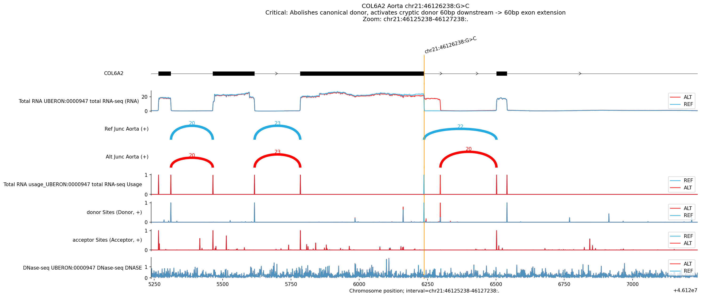

# Variant Analysis Report: COL6A2 chr21:46126238:G>C

## 1. Summary

The variant **chr21:46126238:G>C** in **COL6A2** is predicted to have a
**critical impact on splicing** in **Aorta** and other vascular tissues. The
substitution abolishes the canonical splice donor site (Score decrease > 14) and
activates a refined cryptic splice donor site **60bp downstream** (Score
increase > 14). This results in a **60bp exon extension**, which leads to the
in-frame insertion of 20 amino acids into the COL6A2 protein. The effect is
highly significant (Quantile Score > 0.99999) across multiple vascular tissues,
aligning with the gene's function in connective tissue structure.

## 2. Visual Analysis (Aorta)

**Interpretation:**

-   **Junction Tracks (Sashimi):**
    -   **Ref (Blue):** Canonical donor usage is dominant.
    -   **Alt (Red):** Canonical donor is lost (0 reads). A new cryptic junction
        appears **60bp downstream** (high read count).
-   **Splice Sites:**
    -   Confirms the loss of the canonical donor site at `46126238` and the gain
        of a strong cryptic donor site at `46126298`.
-   **Net Effect:** 60bp extension of the exon.

## 3. Genomic Context & Mechanism

-   **Gene**: *COL6A2* (Collagen Type VI Alpha 2 Chain)
-   **Strand**: Plus (+)
-   **Mechanism**: **Cryptic Splice Donor Activation causing Exon Extension**
    1.  **Canonical Loss:** The G>C mutation disrupts the consensus sequence of
        the canonical splice donor at `chr21:46126237`.
    2.  **Cryptic Gain:** This forces the spliceosome to utilize a cryptic donor
        site located 60bp downstream at `chr21:46126297`.
    3.  **Consequence:** The exon is extended by 60 base pairs.
    4.  **Protein Impact:** 60bp / 3 = 20 codons. This is an **in-frame
        insertion** of 20 amino acids, potentially disrupting the triple-helical
        domain or other structural properties of COL6A2.

## 4. Conclusion

The **chr21:46126238:G>C** variant in *COL6A2* disrupts the canonical splice
donor and activates a cryptic site 60bp downstream. This drives a 20-amino acid
in-frame insertion, likely destabilizing the collagen triple helix—a
well-established mechanism for *COL6A*-related muscular disorders.
