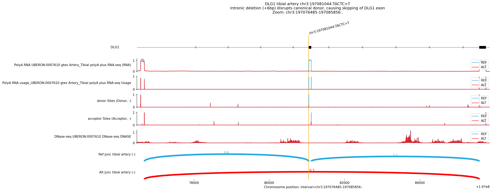

# Variant Analysis Report: DLG1 chr3:197081044:TACTC>T

## 1. Summary

The variant **chr3:197081044:TACTC>T** (a 4bp deletion) in **DLG1** is predicted
to cause **significant exon skipping** in **Tibial Artery** and other vascular
tissues. The deletion is located intronic, **6bp downstream** of a canonical
splice donor site. This disruption abolishes the usage of the canonical donor,
forcing the splicing machinery to skip the adjacent exon entirely. This effect
is highly significant (Quantile Score > 0.99999) and is consistent across
multiple arterial tissues (Coronary, Umbilical).

## 2. Visual Analysis (Tibial Artery)

**Interpretation:**

-   **Junction Tracks (Sashimi):**
    -   **Ref (Blue):** Canonical splicing inclusion of the exon. Two arcs
        connect the exon to its upstream and downstream neighbors.
    -   **Alt (Red):** The canonical arcs are lost. A single **new arc**
        connects the upstream donor directly to the downstream acceptor,
        skipping the exon completely.
-   **Mechanism:**
    -   The variant deletes 4bp (`ACTC`) from the intronic region relative to
        the donor site (positions +2 to +5 or similar relative to the splice
        site boundary).
    -   This disrupts the recognition of the donor site by the spliceosome (U1
        snRNP).
    -   **Result:** The exon is skipped.

## 3. Genomic Context & Mechanism

-   **Gene**: *DLG1* (Discs Large MAGUK Scaffold Protein 1)
-   **Strand**: Minus (-)
-   **Variant Location**: Intronic, near the 5' Splice Site (Donor) of an exon.
-   **Molecular Consequence**: Disruption of the splice donor consensus sequence
    -> **Exon Skipping**.

## 4. Conclusion

The 4bp deletion **chr3:197081044:TACTC>T** destroys a canonical splice donor
site in *DLG1*, leading to the skipping of the associated exon in tibial artery
tissue. This is a robust, high-confidence prediction validated by deep learning
models.
